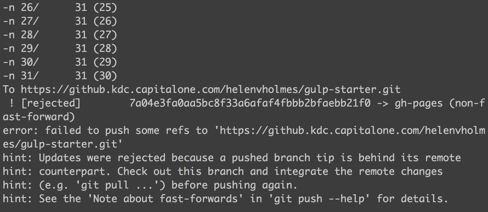

# Gulp Starter

A web application starter using [Gulp](http://gulpjs.com/), [node-sass](https://github.com/sass/node-sass), [Browserify](http://browserify.org/), [Browsersync](http://www.browsersync.io/), [Imagemin](https://www.npmjs.com/package/gulp-imagemin), [Gulp-notify](https://github.com/mikaelbr/gulp-notify), [Jade](http://jade-lang.com/), and [Watchify](https://github.com/substack/watchify) for super fast builds. Built off of [Dan Tello's Gulp Starter](https://github.com/greypants/gulp-starter) which is really rad.

## Getting Started
First of all, this project assumes you have [Node](http://nodejs.org/) installed. If you don't, install that first.

If you do have Node installed, navigate to the gulp-starter directory and install your dependencies:

```
npm install
```

Then run the project with:

```
gulp
```

You don't even have to open your web browser.

## Deploy/gh-pages
You can automatically deploy from your ```master``` or feature branches by using the ```gulp deploy``` task. This will take whatever is currently in the ```build/``` folder and update the ```gh-pages``` branch with its contents, with the benefit of not having to swap back and forth between the two. If you run into fast-forwarding issues and need to force push, check the [deploy task comment](https://github.kdc.capitalone.com/helenvholmes/gulp-starter/blob/master/gulp/tasks/deploy.js) for a fix.

It's not rare to get this error:



This is a fast-forward error. In essence it's saying you need to deploy before you can pull. However, in this instance, we recommend a force-push as your ```gh-pages``` branch should not be something you track as a team and should be checked locally before pushing. If you get this error, check the [deploy task](https://github.kdc.capitalone.com/helenvholmes/gulp-starter/blob/master/gulp/tasks/deploy.js), line 9 for additional information on how to proceed.

## Gulp Tasks
The Gulp tasks are each packaged into their specified functionality with ```config.js``` setting global variables across the project like directory locations. If you need more functions that aren't in here consider [contributing back](https://github.kdc.capitalone.com/helenvholmes/gulp-starter/compare/).

## ```.editorconfig```
This project uses an ```.editorconfig```. This allows us to make sure that things like whitespace changes don't create useless git commits and allows consistency across a larger team of developers. It will apply these changes locally after you close and reload them. You can read about that design choice [here](https://github.com/sindresorhus/editorconfig-sublime/issues/6#issuecomment-45747035).

If you don't have a plugin for your editor of choice, you can [download plugins for EditorConfig from the EditorConfig site](http://editorconfig.org/#download).

## Why is ```build/``` not in the ```.gitignore```?
```build/``` is not in the ```.gitignore``` because it needs to be tracked in order for the ```gulp deploy``` function to work. Annoying, but necessary. If you have suggestions that would make working with this easier consider [contributing back](https://github.kdc.capitalone.com/helenvholmes/gulp-starter/compare/).